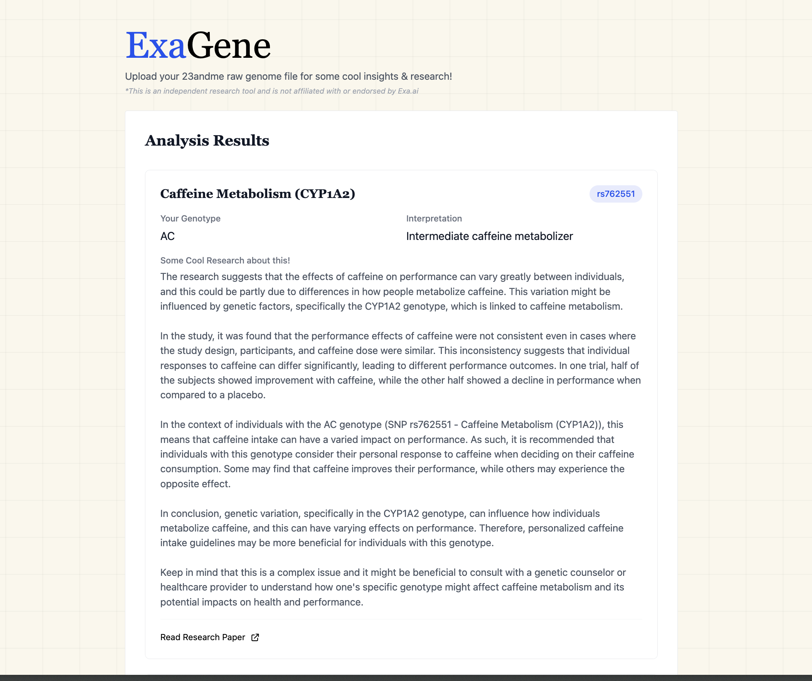

# ExaGene - Genomic Analysis Tool

**Disclaimer**: This tool is an independent project and is not affiliated with or endorsed by Exa.ai.

ExaGene is an open-source tool that analyzes 23andMe raw genetic data to provide insights based on current scientific research. It uses AI to search and summarize relevant research papers for your specific genetic variants.



## Features

- Upload and analyze 23andMe raw genome files
- Analysis of key SNPs (Single Nucleotide Polymorphisms)
- Latest Research paper analysis using Exa.ai
- AI-powered summaries of scientific findings

## Quick Start

1. Clone the repository:

```bash
git clone https://github.com/yourusername/gene-analyzer.git
cd gene-analyzer
```

2. Install dependencies:

```bash
# Install server dependencies
cd server
npm install

# Install client dependencies
cd ../client
npm install
```

3. Set up environment variables:

Create `server/.env`:
```env
PORT=3001
OPENAI_API_KEY=your_key_here
EXASEARCH_API_KEY=your_key_here
```

Create `client/.env`:
```env
REACT_APP_API_URL=http://localhost:3001
```

4. Start the development servers:

```bash
# Start server (from server directory)
npm run dev

# Start client (from client directory)
npm start
```

## Architecture

### Frontend
The React frontend (referenced in `client/src/App.tsx`) provides a simple interface for:
- File upload component
- Results display
- Research paper summaries

### Backend
The Node.js/Express backend handles:
- 23andMe file parsing (see `server/src/services/parseService.ts`)
- SNP analysis and ranking
- Integration with Exa.ai for research paper search
- OpenAI for research summarization

## How It Works

1. **File Upload**: Users upload their 23andMe raw data file
2. **Parsing**: The server parses the genetic data file (see `server/src/services/parseService.ts`)
3. **SNP Analysis**: The system matches user genotypes with our curated list of SNPs
4. **Research Integration**: For each relevant SNP:
   - Searches for recent research papers using Exa.ai
   - Generates summaries using OpenAI
   - Returns personalized interpretations

## Limitations and Considerations

1. **Single SNP Analysis**: 
   - Currently analyzes individual SNPs rather than polygenic scores
   - May not capture complex trait interactions
   - Results should be interpreted with caution

2. **Research Interpretation**:
   - AI-generated summaries may not capture full context
   - Results should not be used for medical decisions

3. **Data Privacy**:
   - Genetic data is processed in-memory only
   - No user data is stored
   - Consider self-hosting for sensitive data

## Privacy & Security

- No genetic data is stored
- File processing happens in-memory
- Uses secure file upload
- Environment variables for API keys


## Research Background

The SNP selection and interpretation are based on peer-reviewed research. Current SNPs include:
- Metabolism variants
- Nutrient processing
- Physical traits
- Health predispositions

See `server/src/data/SNPs.json` for the complete list.


## Disclaimer

This tool is for research and educational purposes only. It should not be used for medical diagnosis or treatment decisions.

---
